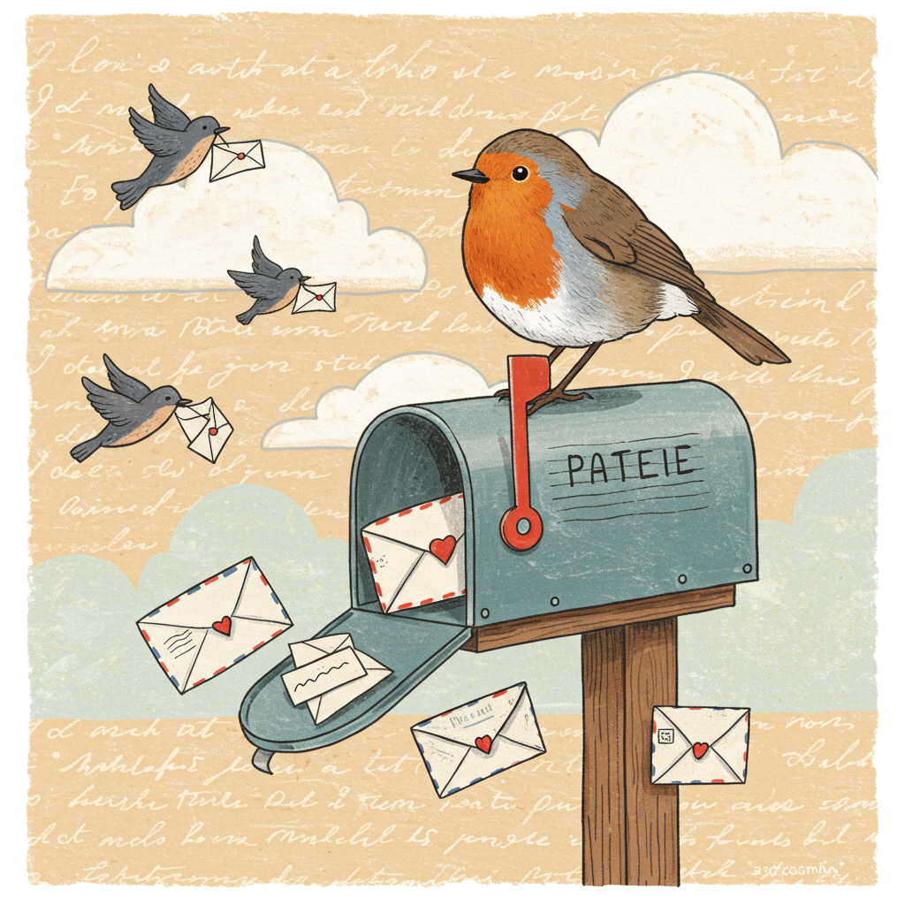

<h1 align="center">
  
</h1>
<h4 align="center">
  
  
  

  </a>
</h4>

  
<b>Sharing letters, one typo at a time   <a href="https://float-app.fun/"> Round Robin » </a> </b> 

## Features

- [X]  Base Round Robin  1999-2016
- [X]  Tags for Search
- [ ]  Comment on Letters
- [ ]  Add Missing Letters to Round Robin
- [ ]  Edit Current Letters that don't conform after Optical Content Recognition
- [ ]  Picture Gallery both for Immediate and Extended Family
- [ ]  Family Documents for both Immediate and Extended Family

## Getting Started

To run this blog locally:

1.  Clone the repository: `git clone [repository URL]`
2.  Install dependencies: `npx pnpm install` 
3.  Run the development server: `npx pnpm dev`
4.  Open your browser and navigate to `http://localhost:5173`

## Contributing

Reach out to your Round Robin Contact for credentials to modify base application 
